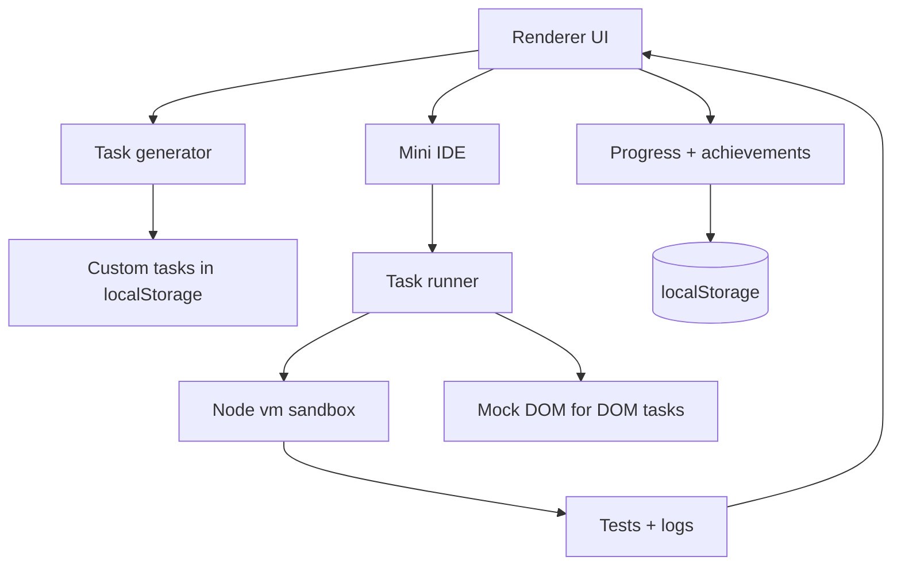

# JS Infinite Trainer

## Позиционирование

JS Infinite Trainer - это не просто генератор задач. Это адаптивный coding gym для ежедневной практики программирования.

### Что он делает

- подбирает следующую задачу из твоих слабых мест;
- даёт мгновенную проверку и короткий цикл обратной связи;
- удерживает streak, XP и уровни;
- работает оффлайн на Windows;
- поддерживает несколько языков и custom-задачи.

### Чем он отличается

- Не LeetCode: здесь меньше “интервью-банка” и больше ежедневной тренировки.
- Не Codewars: здесь нет зависимости от комьюнити-уровня и поиска kata, зато есть персональная адаптация.
- Не курс: здесь не нужно проходить уроки по порядку, система выдаёт следующую нагрузку сама.
- Не просто streak-игра: каждое решение проверяется реальным кодом.

### Для кого это

- самоучки, которым нужен ежедневный маршрут;
- джуны и мидлы, которые хотят подтянуть слабые темы;
- люди, которые не хотят тратить время на выбор задачи вручную;
- команды и менторы, если позже добавить отчётность и общий прогресс.

Десктопное приложение для Windows на Electron, которое бесконечно генерирует задачи по JavaScript, проверяет решения тестами и хранит прогресс локально.

## Как это устроено



### Слои

1. `main.js` создаёт окно Electron.
2. `preload.js` открывает безопасный мост `window.appApi`.
3. `src/core/taskEngine.js` is the main generation orchestrator; `src/taskEngine.js` remains the legacy base implementation behind the new facades.
4. `src/runtime/` contains execution and test-running facades.
5. `src/tasks/` contains task-category builders.
6. `src/renderer/app.js` управляет интерфейсом, прогрессом, подсказками и custom-задачами.
7. `src/ui/index.html` is the UI bootstrap, while `src/renderer/index.html` and `src/renderer/styles.css` keep the current renderer implementation.

## Пример интерфейса

```text
┌ Sidebar ─────────────────────────────────────────────────────┐
│ Категории  Сложность  Режимы  Прогресс  Достижения          │
│ Своя задача: форма + список пользовательских кейсов         │
├──────────────────────────────────────────────────────────────┤
│ Hero: название задачи, теги, сигнатура, действия             │
│ Mini IDE: line numbers + editor + Ctrl+Enter                 │
│ Результаты | Подсказки / Ответ | Логи                       │
└──────────────────────────────────────────────────────────────┘
```

## Генерация задач

Задачи строятся процедурно:

1. Выбирается категория.
2. Выбирается сложность.
3. Вариант задачи собирается из шаблона и случайных данных.
4. Для каждого шаблона генерируются:
   - условие,
   - стартовый код,
   - эталонное решение,
   - тесты.

### Поддерживаемые категории

- Массивы
- Объекты
- Функции
- Замыкания
- Асинхронность
- DOM
- Алгоритмы

### Уровни сложности

- Лёгкий
- Средний
- Сложный
- Эксперт

## Проверка решений

Проверка идёт в `vm`-песочнице Node.js:

- пользователь пишет функцию `solve(...)`,
- тесты вызывают её на нескольких наборах данных,
- ошибки и `console.*` выводятся в интерфейс,
- для DOM-задач используется мок `document`.

## Custom-задачи

Встроенная форма позволяет сохранить собственную задачу в локальное хранилище.

Поддерживаемый JSON для тестов:

```json
[
  {
    "args": [[1, 2, 3]],
    "expected": [1, 2, 3]
  }
]
```

Для более продвинутых кейсов можно использовать такие спеки аргументов:

```json
{ "__fn": "asyncValue", "value": 10, "key": "load-score" }
```

## Запуск

```bash
npm install
npm start
```

## Файлы

- `main.js`
- `preload.js`
- `src/taskEngine.js` - legacy root copy, kept out of the app path
- `src/legacy/taskEngineLegacy.js`
- `src/core/taskEngine.js`
- `src/engine/rng.js`
- `src/engine/utils.js`
- `src/engine/taskBuilder.js`
- `src/tasks/arrays.js`
- `src/tasks/objects.js`
- `src/tasks/functions.js`
- `src/tasks/closures.js`
- `src/tasks/async.js`
- `src/tasks/algorithms.js`
- `src/tasks/dom.js`
- `src/runtime/executor.js`
- `src/runtime/testRunner.js`
- `src/generation/index.js`
- `src/execution/index.js`
- `src/adapters/index.js`
- `src/ui/index.html`
- `src/renderer/index.html`
- `src/renderer/styles.css`
- `src/renderer/app.js`

## Project Layers

- `src/generation/` - task generation facade.
- `src/execution/` - execution layer and IPC bridge.
- `src/adapters/` - language adapters for each runtime.
- `src/ui/` - UI bootstrap entrypoint.
- `src/renderer/` - current renderer implementation used by the UI bootstrap.
- `src/legacy/` - archived monolithic engine copy kept for compatibility and migration.
